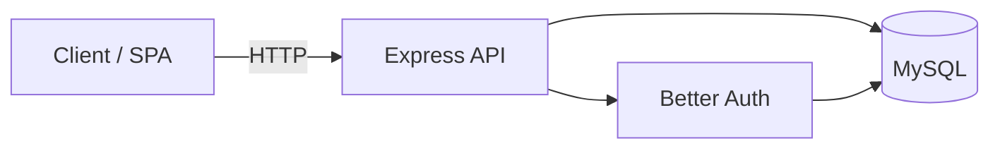

# Express · Drizzle · Better Auth — Zyntera API Blueprint

A production-oriented **Node.js API template**: [Express 5](https://expressjs.com/), [Drizzle ORM](https://orm.drizzle.team/) with **MySQL**, [Better Auth](https://www.better-auth.com/) for authentication, [Zod](https://zod.dev/) for environment validation, and [Pino](https://getpino.io/) for structured logging. Use it as a starting point for SPAs, mobile backends, or internal services—swap branding, domains, and business logic as needed.

---

## Table of contents

- [Architecture](#architecture)
- [Features](#features)
- [Prerequisites](#prerequisites)
- [Quick start](#quick-start)
- [Create with CLI (`create-zyntera-app`)](#create-with-cli-create-zyntera-app)
- [Configuration](#configuration)
- [Scripts](#scripts)
- [API surface](#api-surface)
- [Database & migrations](#database--migrations)
- [Testing](#testing)
- [Docker](#docker)
- [Security & operations](#security--operations)
- [Using this repo as a template](#using-this-repo-as-a-template)
- [Troubleshooting](#troubleshooting)
- [License](#license)

---

## Architecture



| Layer        | Responsibility |
|-------------|----------------|
| **Routes**  | Versioned API under `/api/v1`; Better Auth catch-all; protected `/me`. |
| **Services**| Session helpers and user operations. |
| **Repositories** | Drizzle queries against MySQL. |
| **Config**  | Typed `env`, DB pool, logger, Better Auth instance. |

---

## Features

- **TypeScript** with `strict` mode, ESM (`"type": "module"`), NodeNext resolution.
- **Validated configuration** — fails fast at startup if env vars are missing or invalid.
- **Auth** — Better Auth with Drizzle adapter; email/password enabled in config (extend with plugins as needed).
- **Observability** — request logging via `pino-http`; sensitive fields redacted in logs.
- **Safety** — Helmet, CORS with credentials, JSON body size limit.
- **DX** — Vitest for tests, Drizzle Kit for migrations, optional Docker Compose for MySQL + dev container.

---

## Prerequisites

- **Node.js** 20+ (LTS recommended; CI images in this repo use current Node Alpine/Slim).
- **MySQL** 8.x (local install, managed service, or Compose service).
- **npm** (or pnpm/yarn if you adapt lockfiles).

---

## Create with CLI (`create-zyntera-app`)

Similar to **create-vite**, you can scaffold this repo with a wizard that sets the **project folder name**, writes **`.env`** (including a generated `BETTER_AUTH_SECRET` and a URL-safe `DATABASE_URL`), and optionally runs **`npm install`**.

After you [publish](https://docs.npmjs.com/cli/v9/commands/npm-publish) the `create-zyntera-app` package from the `create-zyntera-app/` directory in this repository:

```bash
npm create zyntera-app@latest
# or with a name up front:
npm create zyntera-app@latest my-api
```

Use another GitHub template (default is this blueprint) with:

```bash
ZYNTERA_TEMPLATE=owner/other-repo npm create zyntera-app@latest my-api
# or
npx create-zyntera-app@latest my-api --template owner/other-repo
```

**Local try (before publishing):** from the `create-zyntera-app` folder, run `node cli.mjs my-test-api` (or `npm link`, then `create-zyntera-app my-test-api`).

The template clone uses [degit](https://github.com/Rich-Harris/degit); paths listed in [`.degitignore`](.degitignore) (for example `create-zyntera-app/`) are not copied into new projects.

---

## Quick start

### 1. Clone and install

```bash
git clone <your-fork-or-repo-url>
cd <project-directory>
npm install
```

### 2. Environment

Copy the example file and fill in values:

```bash
cp .env.example .env
```

- Generate a Better Auth secret (minimum length enforced by the app):

  ```bash
  openssl rand -hex 32
  ```

- Set `DATABASE_URL` to a valid MySQL URL (see [Configuration](#configuration)).
- Ensure `BETTER_AUTH_URL` matches the public origin clients use (e.g. `http://localhost:3000` in development).

### 3. Database

Create the database and user if needed, then run migrations (after generating them from the schema, or from an existing `drizzle/` folder):

```bash
npm run db:migrate
```

### 4. Run in development

```bash
npm run dev
```

The server listens on `PORT` (default **3000**). Verify with:

```bash
curl -s http://localhost:3000/health
```

---

## Configuration

All runtime settings are defined in [`src/config/env.ts`](src/config/env.ts) and validated with Zod. Reference [`.env.example`](.env.example) when creating `.env`.

| Variable | Required | Description |
|----------|----------|-------------|
| `NODE_ENV` | No | `development` (default) or `production`. |
| `PORT` | No | HTTP port (default `3000`). |
| `LOG_LEVEL` | No | Pino level: `trace` … `fatal` (default `info`). |
| `DATABASE_URL` | Yes | MySQL connection URL for Drizzle and Drizzle Kit. |
| `DB_HOST` | Yes | MySQL host (used by app pool in `db.ts`). |
| `DB_PORT` | No | MySQL port (default `3306`). |
| `DB_USER` | Yes | Database user. |
| `DB_PASSWORD` | Yes | Database password. |
| `DB_NAME` | Yes | Database name. |
| `DB_ROOT_PASSWORD` | Yes | Used by Docker Compose for the MySQL service (not necessarily by the app). |
| `BETTER_AUTH_SECRET` | Yes | Secret for signing sessions/tokens (**≥ 32 characters**). |
| `BETTER_AUTH_URL` | Recommended | Public base URL of the API; must align with Better Auth `basePath` / clients. |

> **Vitest:** [`vitest.config.ts`](vitest.config.ts) loads `.env` for integration tests. Ensure a valid `.env` exists before running tests, or adjust the Vitest env strategy for CI.

---

## Scripts

| Command | Purpose |
|---------|---------|
| `npm run dev` | Dev server with reload (`nodemon` + `tsx`). |
| `npm run build` | Compile TypeScript to `dist/`. |
| `npm start` | Run compiled output (`node dist/index.js`). |
| `npm test` | Run Vitest once. |
| `npm run test_watch` | Vitest in watch mode. |
| `npm run lint` | ESLint on `src/**/*.ts`. |
| `npm run format` | Prettier write on `src/**/*.ts`. |
| `npm run db:generate` | Generate SQL migrations from Drizzle schema. |
| `npm run db:migrate` | Apply migrations. |

---

## API surface

Base path for versioned routes: **`/api/v1`**.

| Method / path | Auth | Description |
|---------------|------|-------------|
| `GET /health` | No | Liveness / uptime JSON. |
| `ALL /api/v1/auth/*` | Varies | **Better Auth** HTTP handler (sign-in, session, etc.). Exact routes depend on Better Auth version and plugins. |
| `GET /api/v1/me` | Yes | Current session payload via `authMiddleware` + controller. |

CORS in development allows `http://localhost:5173` (typical Vite dev server). In production, update the origin in [`src/server.ts`](src/server.ts) to your real frontend URL.

---

## Database & migrations

- **Schema:** [`src/models/schema.ts`](src/models/schema.ts) — `users`, `sessions`, `accounts` (Better Auth–compatible).
- **Drizzle config:** [`drizzle.config.ts`](drizzle.config.ts) — reads `DATABASE_URL` from the environment.

Typical workflow after changing the schema:

```bash
npm run db:generate   # writes SQL under drizzle/
npm run db:migrate    # apply to the database
```

Commit generated migration files when you want reproducible deploys.

---

## Testing

```bash
npm test
```

Tests live under `src/**/__tests__` and `*.test.ts`. Integration tests may hit the real Express app and database depending on setup—keep `.env` aligned with a safe dev database or mock external dependencies in CI as you scale the template.

---

## Docker

- **[`Dockerfile`](Dockerfile)** — multi-stage build: compile with dev dependencies, then a slim runtime image with production `npm install` and `dist/`.
- **[`docker-compose.yml`](docker-compose.yml)** — MySQL 8.4 + app service running `npm run dev` with a bind mount for live code.

Example (from project root, with `.env` populated for Compose variables):

```bash
docker compose up --build
```

Adjust `environment` / `env_file` on the `app` service if you need every variable from `.env` passed into the container—the sample Compose sets `NODE_ENV` and `DATABASE_URL` for the app and wires the DB hostname to `db`.

> **Note:** The production stage copies `package*.json` (ensure filenames match—no typos) before `npm install --omit=dev`.

---

## Security & operations

- Never commit **`.env`** — it is gitignored.
- Rotate **`BETTER_AUTH_SECRET`** if leaked; treat it like a signing key.
- Use TLS in production; set `BETTER_AUTH_URL` to your HTTPS origin.
- Review **CORS** and **Helmet** defaults when exposing the API publicly.
- **MySQL pool** settings live in [`src/config/db.ts`](src/config/db.ts); tune for your load profile.

---

## Using this repo as a template

1. **Rename** the package in `package.json` and update repository URLs.
2. **Replace** placeholder domains in `server.ts` (CORS production origin) and any marketing copy.
3. **Extend** `src/models/schema.ts` and regenerate migrations for your domain tables.
4. **Configure** Better Auth (social providers, 2FA, etc.) in [`src/config/auth.ts`](src/config/auth.ts).
5. **Add** CI (lint, test, build) on your Git host—this repo does not ship a workflow file by default.
6. **Document** any new env vars in `.env.example` and the Configuration table above.

---

## Troubleshooting

| Symptom | What to check |
|---------|----------------|
| Process exits on boot | Zod env validation failed—read the console output and compare with `.env.example`. |
| `BETTER_AUTH_SECRET` error | Must be at least 32 characters. |
| MySQL connection errors | `DB_*` / `DATABASE_URL`, firewall, and that MySQL is reachable from where the app runs (use `db` hostname in Compose, `localhost` on host). |
| MySQL2 warning about `connectionTimeout` | Driver option name may differ by version; align pool options with [mysql2 docs](https://github.com/sidorares/node-mysql2/blob/master/typings/mysql/lib/Pool.d.ts). |
| Auth callbacks / redirects wrong | `BETTER_AUTH_URL` and `basePath` in Better Auth config must match how clients call the API. |
| Vitest / import failures | ESM + `NodeNext`—use `.js` extensions in TypeScript import paths (as in this codebase). |

---

## License

**ISC** — see [`package.json`](package.json) for the SPDX identifier and author field.

---

<p align="center">
  <sub>Zyntera Blueprint for APIs built with Express, Drizzle, and Better Auth. Fork, customize, ship.</sub>
</p>
